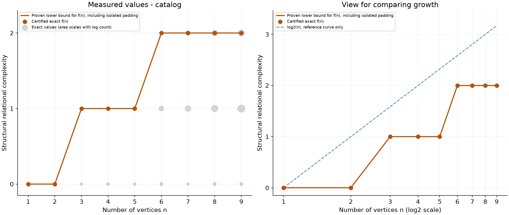
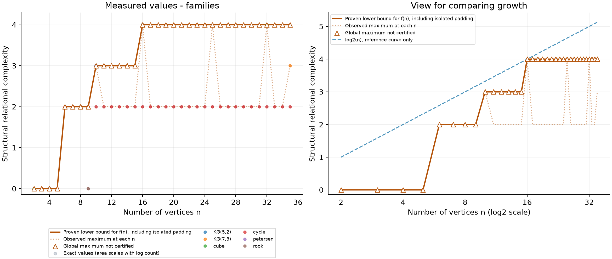

# Relational Complexity Playground

A research tool for computing the **structural relational complexity of finite
simple graphs** and exploring its growth with the number of vertices.

[Český návod](README.cs.md) · [Algorithm](docs/algorithm.md) ·
[Contributing](CONTRIBUTING.md) · [MIT license](LICENSE)

The project studies the extremal function

```text
f(n) = max { rc(G) : G is a simple graph with n vertices }
```

It computes exact values when a search finishes, saves proven bounds when a
limit is reached, and distinguishes exhaustive maxima from sampled lower bounds.
This is a research prototype; finite experiments alone cannot establish whether
`f(n) = Θ(log n)`.



## Quick start

Use **Python 3.12 or 3.13**; local verification used Python 3.13. The direct
dependencies are NetworkX and matplotlib. No GPU or external graph generator
is needed for the first experiment.

From the repository directory, create a virtual environment:

```sh
python -m venv .venv
```

Activate it on Windows PowerShell:

```powershell
.venv\Scripts\Activate.ps1
```

Or on Linux/macOS:

```sh
source .venv/bin/activate
```

Then install dependencies and enumerate all graphs with up to 7 vertices:

```sh
python -m pip install -r requirements.txt
python main.py --mode atlas --max-n 7 --workers 4 --output results/atlas
```

Run `python main.py --help` for all options. `python -m main` is also supported;
the module name after `-m` has no `.py` suffix.

## Experiments

| Mode | Graphs examined | Can certify the global maximum? |
|---|---|---|
| `atlas` | All nonisomorphic graphs through n = 7, including disconnected graphs | Yes, with complete coverage and sufficient bounds |
| `catalog` | Atlas plus complete McKay catalogues for n = 8 and 9 | Yes, subject to the source catalogue's completeness |
| `families` | Selected named families | Provides lower bounds |
| `circulant` | A systematic sequence of circulant connection sets | Provides lower bounds |
| `random` | Reproducible G(n,p) samples | Provides lower bounds |
| `graph6` | Graphs from a user-supplied graph6 file | Provides lower bounds |
| `geng` | Nonisomorphic graphs streamed from an external nauty `geng` executable | Yes, with complete generation and sufficient bounds |

Complete enumeration through n = 9:

```sh
python main.py --mode catalog --max-n 9 --workers 4 --plot-every 25000 --output results/catalog
```

This downloads the n = 8 and n = 9 catalogues from
[Brendan McKay's graph collection](https://users.cecs.anu.edu.au/~bdm/data/graphs.html)
and caches them in the output directory. Counts and duplicate records are checked;
SHA-256 hashes detect later changes to cached files. Completeness up to isomorphism
comes from the published catalogue, rather than from the record count alone.

Compare symmetric families:

```sh
python main.py --mode families --min-n 3 --max-n 35 --families cycle cube petersen rook kneser --workers 4 --output results/families
```

Available families are paths, cycles, complete graphs, balanced complete bipartite
graphs, Petersen, hypercubes, square rook graphs `L(K(s,s))`, and odd Kneser graphs
`KG(2k+1,k)`. Their order is the number of graph vertices: a hypercube has `2^d`
vertices, a square rook graph `s²`, and an odd Kneser graph `binom(2k+1,k)`.

Other examples:

```sh
python main.py --mode circulant --min-n 6 --max-n 20 --samples 1000 --workers 4 --output results/circulants
python main.py --mode random --min-n 5 --max-n 30 --samples 100 --p 0.3 --seed 42 --workers 4 --output results/random
python main.py --mode graph6 --input graphs.g6 --min-n 10 --max-n 40 --workers 4 --output results/custom
python main.py --mode geng --geng /path/to/geng --min-n 10 --max-n 10 --workers 4 --plot-every 25000 --output results/geng
```

Install [nauty/Traces](https://users.cecs.anu.edu.au/~bdm/nauty/) separately for
`geng`; on Windows, supply the path to `geng.exe`. The full `geng` executable is
not part of this project. Its streaming interface has been checked with a small
substitute generator. There are already 12,005,168 nonisomorphic graphs at n = 10.

Circulant connection sets are visited in binary order, up to `--samples` per n.
Complement symmetry skips half of the sets, but isomorphic duplicates can remain.
These are candidate searches, not uniform samples of all graphs. Random graphs
often have trivial automorphism groups and rc = 1, so they are weak candidates
for finding high extremal complexity. Johnson/Kneser, Grassmann, and strongly
regular graphs are more relevant larger families, though the generic backend may
be impractical for their large automorphism groups.

`--connected` restricts atlas/catalog/geng/graph6 experiments to connected graphs;
those runs are not marked as certified maxima over all graphs.

## Checkpoints and results

Each graph is committed to SQLite immediately. Re-running a command skips completed
exact results. You may extend the vertex range, increase sample counts, change
worker counts, or add/remove a family selection. Previously saved families remain
in the database and exports. Use a separate output directory for a separate
comparison or a different dataset mode, random seed, probability, or input file.

| File | Contents |
|---|---|
| `experiment.sqlite` | Durable per-graph checkpoints, metadata, and coverage |
| `values.csv` | Graph6, exact values or bounds, status, time, and obstruction witnesses |
| `summary.csv` | Counts, observed maxima, bounds, and `maximum_certified` |
| `distribution.csv` | Counts of exact values at each graph order |
| `plot.png`, `plot.svg` | Linear and logarithmic views |
| `extremal_candidates.g6` | One candidate per summary row, including isolated-vertex padding |

`observed_lower_bound` uses the graphs directly examined at that order.
`padded_lower_bound` also carries forward smaller examples by adding isolated
vertices. Filled plot markers denote certified exact maxima; open markers are
lower bounds. The `log2(n)` curve is a visual reference, not a proved bound or fit.
Means and distributions include only completed exact computations, which may
bias them if searches reached limits. [Details of the conventions](docs/algorithm.md).

Exports are refreshed every `--plot-every` new graphs, approximately every minute,
and at exit. Larger export intervals help with large datasets. To redraw saved data:

```sh
python main.py --plot-only --output results/catalog
```

The first Ctrl+C stops new submissions and lets the bounded queue finish and save.
A second Ctrl+C interrupts waiting. Completed checkpoints survive interruption;
an unfinished graph starts over on the next run. Run one writer per output directory.

## Limits and correctness

Defaults are 30 seconds and 100,000 automorphisms per graph. Limits are cooperative:
an internal NetworkX search can run longer before the next check. Limited results
have an empty `rc`, an explicit status, and proven lower/upper bounds. Retry them:

```sh
python main.py --mode catalog --max-n 9 --timeout 120 --max-automorphisms 500000 --retry-incomplete --workers 4 --plot-every 25000 --output results/catalog
```

`0` disables either limit. Each worker stores its own automorphisms and bitsets.
The search remains exponential in the worst case. There is no GPU backend;
current acceleration comes from obstruction normalization, integer bitsets,
symmetry reduction, and parallel computation across graphs.

The exactness claim depends on the algorithm and complete source coverage. Tests
compare all graphs through n = 6 against an independent exhaustive partial-map
implementation and cover known examples, witnesses, complements, relabelling,
limits, and checkpoint/resume behavior. GitHub Actions is configured to run tests
and a parallel plotting smoke test on Windows and Linux with Python 3.12 and 3.13.

```sh
python -m unittest discover -s tests -v
```

## Example results

The bundled [example summaries](examples/README.md) contain results from 288,266
graphs with orders 1 through 9, all completed exactly:

| n | 1 | 2 | 3 | 4 | 5 | 6 | 7 | 8 | 9 |
|---|---|---|---|---|---|---|---|---|---|
| f(n) | 0 | 0 | 1 | 1 | 1 | 2 | 2 | 2 | 2 |

Petersen and `KG(7,3)` have rc = 3. `Q4`, `Q5`, `L(K4,4)`, and `L(K5,5)` were
computed with rc = 4. These examples give lower bounds at their respective orders,
not certified global maxima for those larger orders.



## Project layout

`main.py` is the CLI entry point, `experiment.py` manages experiments and exports,
and `relational_complexity.py` contains the computation API.
`gpt_rc_brute_force.py` is a historical k-closure draft; it does not compute this
project's structural relational complexity. See [the algorithm note](docs/algorithm.md).

Development plans are in [CONTRIBUTING.md](CONTRIBUTING.md). The first version is
prepared as **0.1.0**, with release notes in [CHANGELOG.md](CHANGELOG.md).

## License

Project code, documentation, and the small computed example summaries are licensed
under the [MIT License](LICENSE). Dependencies retain their own licenses. Full
third-party graph catalogues and generated SQLite databases are not bundled.
